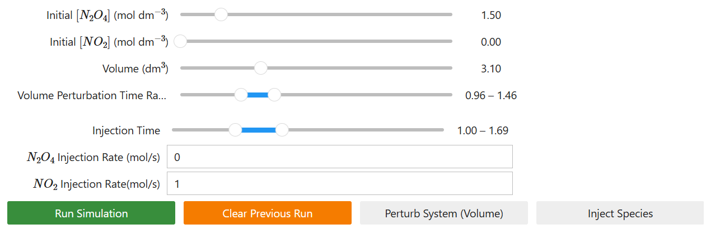
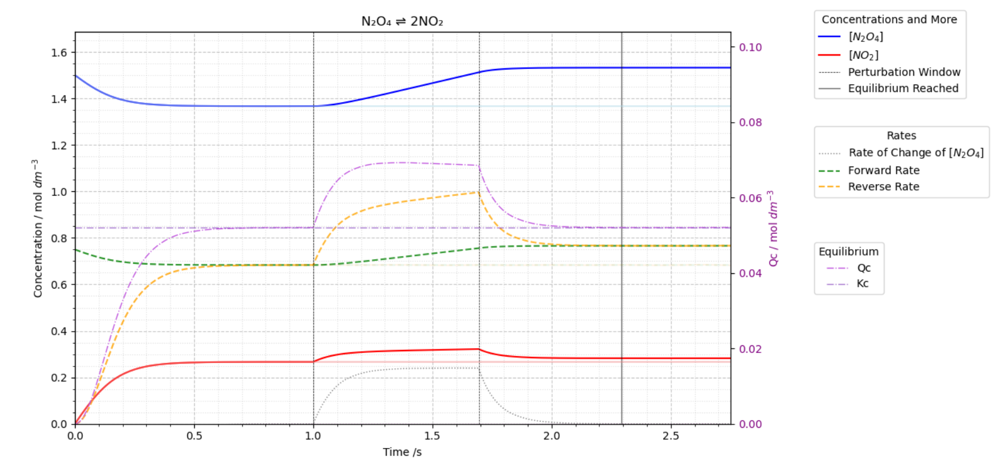
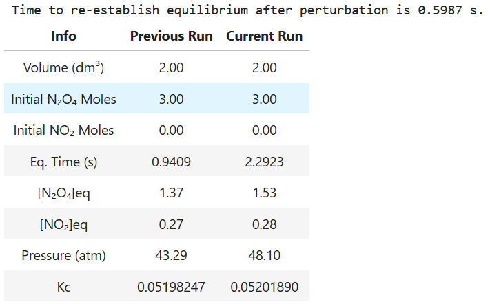
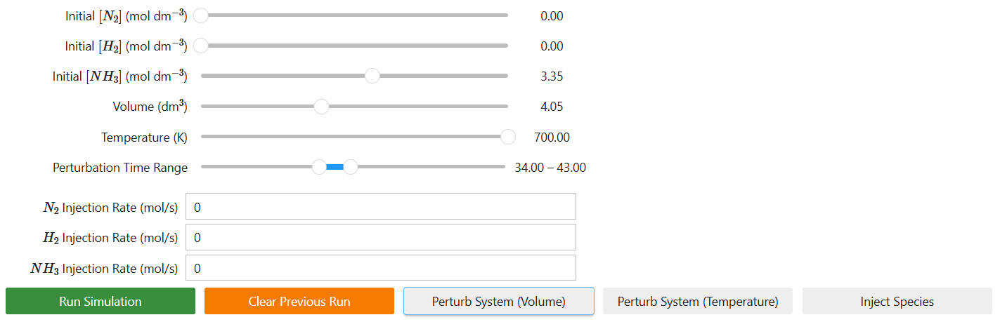
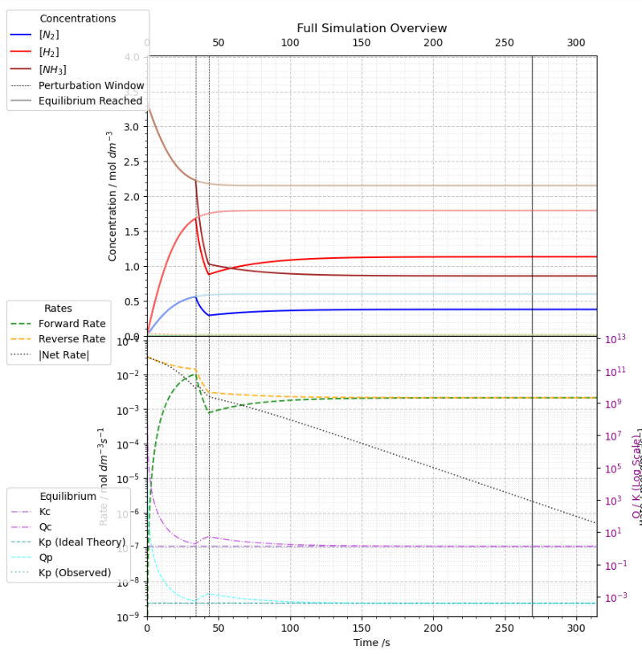
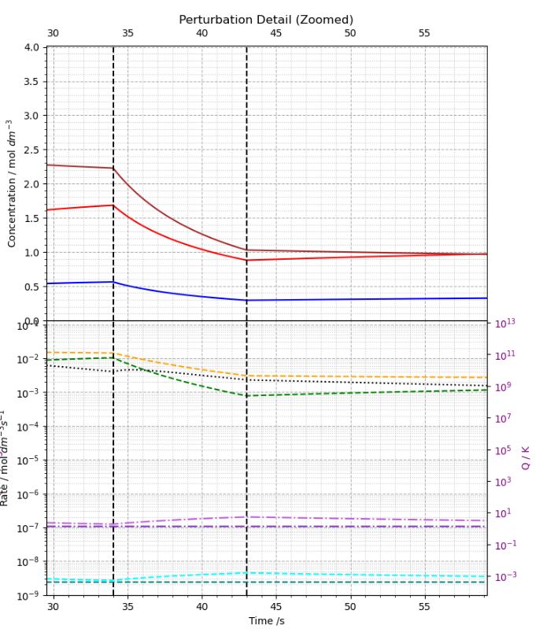
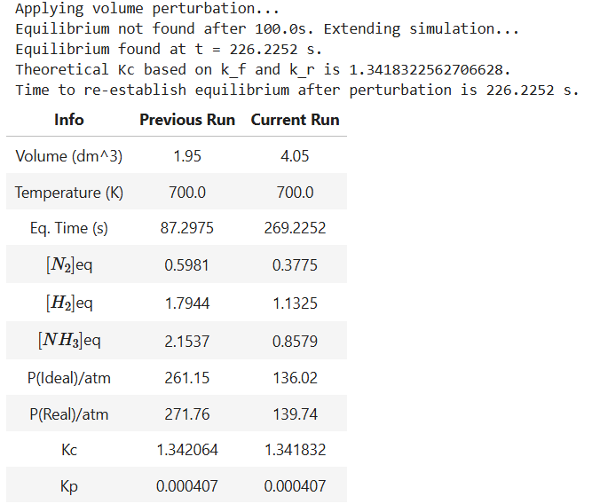

# Interactive-Chemical-Equilibria-Simulator
*A Python-based toolkit for simulating, visualising, and probing complex chemical equilibria, featuring interactive perturbations and real-time kinetic analysis.*

## Overview
This project is a Python-based dashboard built in a Jupyter Notebook environment to simulate and analyze the kinetics of reversible chemical reactions. It moves beyond static textbook examples by providing a fully interactive interface where users can set initial conditions, apply real-time perturbations, and visualize the system's dynamic response as it approaches a new equilibrium.

The core of the simulation is a numerical ODE solver (`scipy.integrate.solve_ivp`) coupled with a modular, class-based architecture that models the chemical system. 

## Key Architectural Features
The simulation is built around a professional Object-Oriented Programming (OOP) model to ensure robustness, scalability, and clarity.

-   **Encapsulation (`ChemicalSystem` Class):** the fundamental state of a reaction (moles, volume, rate constants) and the physical laws that govern it (the ODE system) are bundled into a single, self-contained `ChemicalSystem` object. This eliminates fragile global variables and ensures data integrity.
-   **Composition (`PerturbationSimulation` Class):** complex, multi-stage workflows are managed by an orchestrator class. A `PerturbationSimulation` object takes a baseline `ChemicalSystem` and manages the three-stage process of applying a stress and simulating the relaxation to a new equilibrium. This is a powerful design pattern that separates high-level logic from the core scientific model.
-   **Adaptive Solver Engine:** The engine utilizes an iterative wrapper around `scipy.integrate.solve_ivp`. This allows the simulation to intelligently "search" for equilibrium, automatically extending its simulation window for slow reactions (low T) or refining it for fast reactions (high T). This was first implemented in the second phase of the project (modelling the Haber process).

## Scientific Visualisation Features
- **Interactive Controls (ipywidgets):** set initial concentrations and system volume with sliders.
- **Dynamic Perturbation Engine:** apply stresses to a system at equilibrium, including:
    -   Gradual volume changes (pressure stress).
    -   Continuous injection/removal of chemical species (concentration stress).
- **Analytical Plots (matplotlib):**
    -   Real-time plots of species concentrations.
    -   A secondary Y-axis to compare the **Reaction Quotient (Qc)** against the **Equilibrium Constant (Kc)**.
    -   Plots of forward, reverse, and net reaction rates to illustrate the principles of **dynamic equilibrium**.
- **Professional UI:** maximum plot clarity, including a clean `ipywidgets` interface.

## Case Study 1: $N_2O_4 ⇌ 2NO_2$
*Status: Completed*

The initial implementation of this simulator focuses on the classic gas-phase equilibrium between dinitrogen tetroxide ($N_2O_4$) and nitrogen dioxide ($NO_2$). This reaction is a cornerstone of chemical education, famously used to demonstrate Le Chatelier's Principle, partly due to the distinct visual change as the colourless $N_2O_4$ gas dissociates into the brown $NO_2$ gas. This simulation provides a quantitative, dynamic exploration of the system and its behaviour under various stresses.

This model operates under *ideal gas assumptions* and *isothermal conditions*. It is designed to demonstrate the fundamental mechanical aspects of equilibrium shifting.

*(Link to the model notebook: [models/n2o4_model/N2O4_Equilibrium_Model.ipynb](models/n2o4_model/N2O4_Equilibrium_Model.ipynb))*

### Dashboard Features
| Interactive Controls & Perturbations | Analytical Plot | Comparative Data Table |
| :---: | :---: | :---: |
|  |  |  |
| Users can set initial conditions and apply gradual volume or injection perturbations over a defined time window. | The main plot visualizes concentrations, forward/reverse rates, and the Qc/Kc relationship on a dual-axis. | A table provides key quantitative metrics, comparing the perturbed system against the original baseline run. |

### Key Assumptions & Limitations for This Model
1.  **Isothermal Conditions:** the model assumes the system is held at a constant temperature (323 K). This is a significant simplification, as the forward reaction (dissociation) is endothermic. In a real, isolated system, a shift in equilibrium would cause a temperature change, which would in turn alter the rate constants and the value of Kc.
2.  **Ideal Gas Behavior:** the calculation of total pressure uses the Ideal Gas Law (`PV = nRT`). This approximation becomes less accurate at the higher pressures that can be generated in the simulation, where intermolecular forces and molecular volume (as accounted for in the van der Waals equation) become non-negligible.
3.  **Perfect & Instantaneous Mixing:** the model assumes that concentrations are uniform throughout the entire volume at all times and that any injected species are mixed instantaneously. This ignores the real-world kinetics of gas diffusion and convection.

## Case Study 2: $N_2(g) + 3H_2(g) ⇌ 2NH_3$(g), Haber Process
*Status: Completed (New)*

This stage represents a significant leap in physical complexity. Modeling the industrial synthesis of ammonia, this simulation discards some of the approximations in the previous stage to model the messy reality of industrial chemistry.

*(Link to model: [models/haber_process_model/Haber_Process_Model.ipynb](models/haber_process/Haber_Process_Model.ipynb))*

### Key Upgrades
- **Van der Waals Equation of State:** the Ideal Gas Law is replaced by the van der Waals equation ($[P + a(n/V)^2][V - nb] = nRT$) to account for molecular volume and intermolecular forces.
- **Dynamic Mixing Rules:** the simulation calculates the effective van der Waals constants ($a_{mix}$ and $b_{mix}$) for the mixture at every time-step based on the changing mole fractions of the species.
- **Arrhenius Temperature Dependence:** rate constants are no longer fixed; they are dynamically calculated based on Activation Energy ($E_a$) and Temperature ($T$), according to the Arrhenius equation.
- **Solver Algorithm**: reaction rates at 400K vs 700K differ by orders of magnitude. A fixed-time solver would fail or waste resources. I implemented an *adaptive iterative solver* that intelligently detects equilibrium stability to auto-scale the simulation duration.
- **Kp**: calculated $K_p$ from partial pressures, along with plotting Qp and Kp over time, allowing for comparison with Qc and Kc values.
- **Visualisation**: implemented *logarithmic axes* for thermodynamics to show $K_c$ and $K_p$ simultaneously. Created a *dynamic detail plot* that geometrically zooms into perturbation events (e.g., showing a 10s event within a $10^5$s simulation).

### Dashboard Features
The interface is segmented to provide control, broad analysis, and fine-grained detail simultaneously.

| Component | Visual Interface | Scientific Function |
| :--- | :--- | :--- |
| **Control Panel** |  | **Experimental Design:** allows users to define the reactor conditions. By manipulating density ($N/V$) and Temperature, users can force the system into distinct thermodynamic regimes (such as a case where $P_{real} \gg P_{ideal}$). |
| **Macro-Analysis** |  | **System Overview:**  • **Top:** Concentrations vs Time. • **Bottom (Left):** Log-scale Reaction Rates. Visualises the definition of dynamic equilibrium (Net Rate $\to$ 0). • **Bottom (Right):** Log-scale Thermodynamics. Visualises the equilibrium constants. |
| **Micro-Analysis** |  | **Transient Response:** automatically zooms into the perturbation window (e.g., a 10s injection). This reveals the immediate kinetic "pulse" and the system's restoration of $Q_c \to K_c$, which is often invisible on the macro-scale plot. |
| **Data Table** |  | **Quantitative Verification:** provides a side-by-side comparison of the Baseline vs. Perturbed run. Crucially, it quantifies the error of the Ideal Gas assumption by explicitly listing both **ideal pressure** and **real pressure** (Van der Waals). |

### Key Assumptions & Limitations for This Model
While this is a robust kinetic model, it makes certain assumptions and has some limitations:
1.  **Reaction Mechanism:** The simulation models the global stoichiometry ($N_2 + 3H_2 -> 2NH_3$) as a pseudo-elementary step. In reality, the Haber process is a complex *heterogeneous catalytic reaction* involving adsorption isotherms (Langmuir-Hinshelwood kinetics). Stage 3 will address multi-step mechanisms.
2.  **Thermodynamic Isolation:** The model treats the reactor as *isothermal* (constant T) unless manually perturbed. It does not model the *adiabatic* temperature rise caused by the reaction's exothermicity ($\Delta H = -92$ kJ/mol), which is a critical engineering constraint in real reactors.
3.  **Temperature independence of $\Delta H$:** the model treats the enthalpy of reaction as a constant -92 kJ/mol across all temperatures. Strictily speaking, $\Delta H$ varies with temperature.

Among other assumptions listed in the Jupyter notebook. Since this project is an investigation into physical chemistry rather than engineering, industrial mechanisms such as continuous flow recycling or heat exchangers are intentionally omitted. This isolation allows for a pure visualisation of the fundamental interplay between kinetics and thermodynamics in a controlled, closed-system environment, without the confounding variables of reactor design.

### Numerical Architecture and Verification
Simulating real-time kinetics across a 300K temperature range presents significant computational challenges. This project implements specific algorithms to solve the **"stiffness problem"** inherent in Arrhenius kinetics.

**The Stiffness Challenge**

Reaction rates scale exponentially with temperature ($k = Ae^{-E_a/RT}$).
*   At high temperatures, the reaction can reach equilibrium in seconds (incredibly fast).
*   At low temperatures, the reaction could take years.
A standard fixed-duration simulation would fail: it would either miss the equilibrium at 400K (stopping too early) or waste computational resources simulating static noise at 700K.

**Solution: The Adaptive Iterative Solver**

Instead of a fixed timeline, the `ChemicalSystem` class implements an **autonomous supervisor algorithm**.
1.  The simulation runs in dynamic time "chunks."
2.  After each chunk, the system state is analyzed.
3.  If equilibrium is not reached, the solver preserves the state vector (`y`) and extends the time horizon geometrically.
4.  This allows the dashboard to seamlessly handle widely different timescales without user intervention.

**Equilibrium Detection**

To prevent false positives during transient states (where the rate might momentarily cross zero), equilibrium is only declared when:
1.  **Kinetic Stability:** Net Rate Magnitude $\approx 0$.
2.  **Derivative Stability:** The slope of the rate curve $\approx 0$ (ensuring the system isn't just passing through a turning point).
3.  **Thermodynamic Consistency:** The observed Reaction Quotient ($Q_c$) matches the theoretical $K_c$ within a strict tolerance.

The physics engine has been validated against multiple test cases.

## Project Roadmap
This is a project in progress. The $N_2O_4$ and Haber Process models serve as the foundation for a more comprehensive toolkit. Future planned enhancements include:
- **Multi-Step Reaction Mechanisms:** expanding the ODE solver to handle sequential reactions, such as the oxidation of nitric oxide.
- **Coupled Aqueous Equilibria:** applying the toolkit to model the complex, multi-reaction system that governs ocean acidification.
