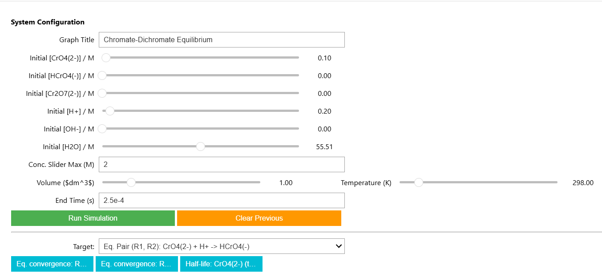
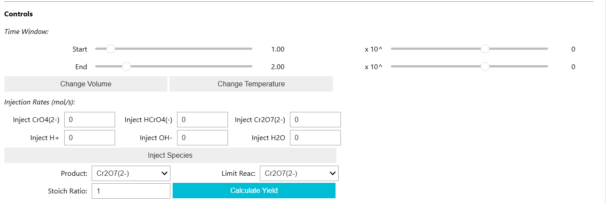
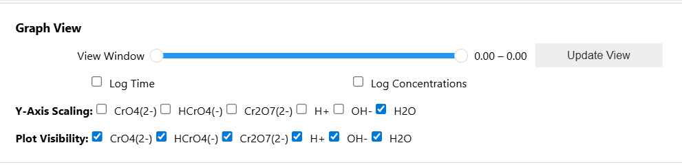
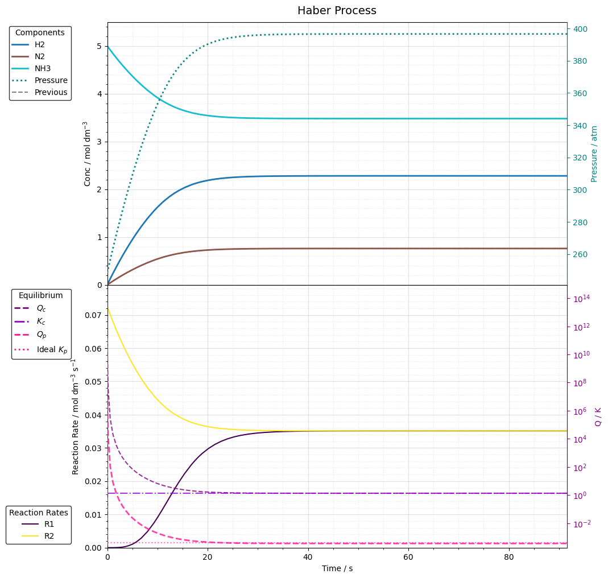
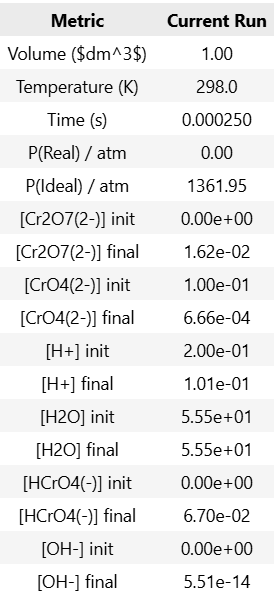
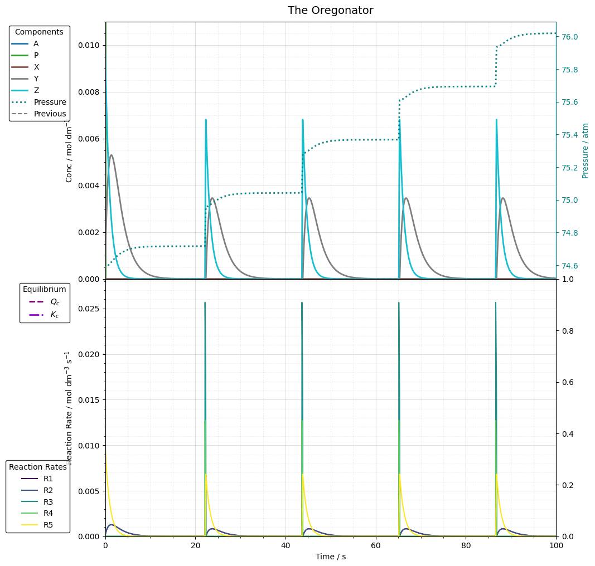
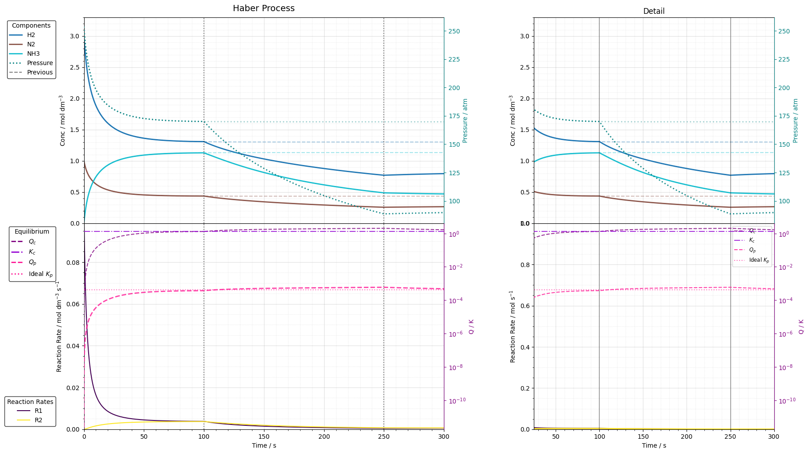
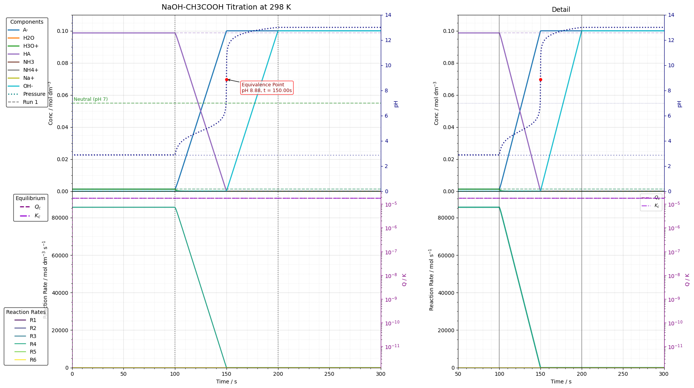

# Interactive-Chemical-Equilibria-Simulator


*A Python-based toolkit for simulating, visualising, and probing complex, multi-step chemical equilibria, featuring interactive perturbations and real-time kinetic analysis. The computational engine is generalised and object-oriented.*

## Overview
This project is a Python-based dashboard built in a Jupyter Notebook environment to simulate and analyse the kinetics of reversible chemical reactions. It moves beyond static textbook examples by providing a fully interactive interface where users can set initial conditions, apply real-time perturbations, and visualise the system's dynamic response as it approaches a new equilibrium. The engine parses a network of chemical species and elementary reaction steps, dynamically constructs the corresponding system of coupled ordinary differential equations (ODEs), and solves them using advanced implicit numerical integration techniques.

The project is a simulation tool designed to model the dynamic evolution of chemical systems over time. Unlike standard equilibrium calculators which only provide the final state ($\Delta G=0$), this engine simulates the *journey*, visualising how reaction intermediates form, how steady states are established, and how systems respond to real-time perturbations in non-ideal conditions.

The engine utilizes an iterative wrapper around `scipy.integrate.solve_ivp`. This allows the simulation to intelligently "search" for equilibrium, automatically extending its simulation window for slow reactions (low T) or refining it for fast reactions (high T). This was first implemented in the second phase of the project (modelling the Haber process).

The primary objective of this software is to bridge the gap between theoretical textbook chemistry and computational reality. It is capable of handling **stiff kinetic systems** (where timescales vary by orders of magnitude), **real-gas non-ideality** (via Van der Waals equations), and **dynamic perturbations**, making it suitable for analysing complex phenomena ranging from the chaotic oscillations of the Belousov–Zhabotinsky reaction to the steady-state dynamics of stratospheric ozone depletion.

For more information, see simulation.ipynb.

## The Engine
For a generalised system of $N$ species and $M$ reactions, the engine models elementary steps using the **law of mass action**. For a reaction $j$:

$$ \frac{dn_i}{dt} = V \sum_{j} \nu_{ij} r_j $$

Where:
-   $V$ is the system volume.
-   $r_j$ is the rate of reaction $j$.
-   $\nu_{ij}$ is the stoichiometric coefficient of species $i$ in reaction $j$ (negative for reactants, positive for products).

### Matrix-Based ODE Construction
To optimise performance for stiff solvers, the engine avoids iterative loops during integration. Instead, it constructs a **stoichiometry matrix ($\mathbf{S}$)** of dimensions $(N \times M)$. The net rate of change vector for all species, $\frac{d\mathbf{n}}{dt}$, is computed via a single vectorised operation:

$$\frac{d\mathbf{n}}{dt} = V \cdot (\mathbf{S} \times \mathbf{r})$$

Where $\mathbf{r}$ is the vector of reaction rates. This formulation allows the Jacobian matrix to be computed efficiently, which is a requirement for implicit integration methods.

### Real Gas Calculations
The engine implements the Van der Waals equation of state to model non-ideal behavior:

$$\left( P + \frac{a_{mix} n^2}{V^2} \right) (V - n b_{mix}) = nRT$$

Crucially, the engine applies **mixing rules** to calculate effective constants for the evolving mixture at every time step:
*   **Attraction parameter ($a_{mix}$):** calculated via quadratic mixing rule $\left( \sum x_i \sqrt{a_i} \right)^2$.
*   **Volume parameter ($b_{mix}$):** calculated via linear mixing rule $\sum x_i b_i$.

This allows the system to derive the **compressibility factor ($Z$)** and **fugacity** deviations during the simulation.

### Auxiliary Functions
Beyond the core physics engine, the project includes a suite of auxiliary functions designed to ensure data integrity, numerical stability, and scientific accuracy, such as `sanitise_results`, used for data sanitisation.

## 4. Software Architecture
The codebase is designed using strict object-oriented programming (OOP) principles to ensure modularity and scalability.

### Core Modules
#### `ChemicalSpecies`
Defines the "identity" of a molecule.
*   **Attributes:** molar mass, density, phase (gas/liquid/solvent/pool), and Van der Waals constants.
*   **Feature:** supports "Pool" species (fixed concentration), allowing the simulation of open systems (chemostats) where reactants are continuously replenished.

#### `Reaction`
Defines the "rules" of interaction.
*   **Attributes:** stoichiometry (reactants/products), Arrhenius parameters ($A, E_a$).
*   Reversible reactions are instantiated as two separate `Reaction` objects (Forward/Reverse). The engine's `find_all_equilibrium_pairs()` utility automatically links them for thermodynamic analysis.

#### `ChemicalSystem`
This is the physics engine that integrates the ODEs.
*   **Adaptive stepping:** uses an iterative "chunking" algorithm. It simulates in small time segments, checks for convergence, and expands the time horizon geometrically. This ensures the simulation runs exactly as long as necessary.
*   **Solver interface:** wraps `scipy.integrate.solve_ivp` with custom state-vector adapters to map between Dictionary keys (species names) and Numpy arrays.

#### `PerturbationSimulation`
Manages discontinuities to simulate Le Chatelier’s Principle.
*   **Mechanism:** implements a 3-stage stitching algorithm (pre-stress $\to$ stress $\to$ relaxation).
*   **Capabilities:** can simulate volume ramps (compression and expansion), temperature ramps, or species injection (e.g., adding a catalyst midway through, taking out a product).

#### `SystemTester` (`validation_toolkit.py`)
A professional-grade diagnostic suite. Some example tests in this suite include:
*   **Mass conservation:** verifies $\Delta mass < 10^{-9}$ g.
*   **Autocatalysis detection:** scans the stoichiometry matrix for $X \to 2X$ patterns. If found, it switches the solver from "convergence mode" to "oscillation mode" to capture limit cycles.
*   **Steady-state verification:** mathematically verifies the "gap" between $Q_c$ and $K_c$ using the Steady State Assumption (SSA) formula.

## Scientific Visualisation Features
* **Interactive Controls (`ipywidgets`):** set initial concentrations and system volume with sliders.
* **Dynamic Perturbation Engine:** apply stresses to a system at equilibrium, including:
    *   Gradual volume changes (pressure stress).
    *   Continuous injection/removal of chemical species (concentration stress).
* **Analytical Plots (`matplotlib`):**
    *   Real-time plots of species concentrations, rates of changes, and other variables such as pressure.
    *   A secondary Y-axis to compare the **reaction quotient (Qc)** against the **equilibrium constant (Kc)**, along with **Qp** and **Kp**.
    *   Plots of forward, reverse, and net reaction rates to illustrate the principles of **dynamic equilibrium**.

### Interface & Analysis Features
#### Simulation Control:
* End Time:
    * **Convergence mode (default):** if empty, the engine uses an adaptive "chunking" algorithm, running until completion of the reaction is detected ($rate<10^{-7}$) or a steady state.
    * **Fixed end time mode:** by entering a value (e.g., `500.0s`), the user forces the simulation to run for a specific duration. This is essential for analysing things such as oscillationg reactions (which never converge) or capturing the initial transient kinetics of extremely slow reactions.
* Conc. Slider Max:
    * Chemical systems vary from millimolar biological processes to neat industrial reagents (> 50 M). This control allows the user to rescale the input sliders dynamically, ensuring precision input regardless of the concentration magnitude.
      
#### Advanced Visualisation Tools
| **Main Dashboard** | **Graphing & View Controls* |
| :---: | :---: |
| <br> |  |
| *This is where the controls are. Note the dynamically generated sliders for each species and the scientific notation inputs for precise time-window selection.* | *Detailed view of the plotting logic. Includes toggles for logarithmic time/concentration axes and the "Focus Buttons" automatically generated from event analysis.* |
| **Simulation Output: Haber Process** | **Analytical Data Table** |
|  |  |
| *Standard output for a converging system. The top plot shows concentration evolution; the bottom plot tracks reaction rates and thermodynamic quotients ($Q_c/K_c$).* | *The data summary panel. It automatically aligns and compares the "Previous Run" vs "Current Run", identifying exact completion times and final pressures.* |

*   **Stiff Time-Window Controls:**
    *   Reactions often have critical events at $10^{-6}s$ (initial equilibrium) and $10^{3}s$ (bulk product formation). A standard linear slider is useless here. The interface uses a **scientific notation input** (mantissa $\times 10^{\text{exponent}}$), allowing users to precisely target perturbation windows across 15 orders of magnitude.
*   **Logarithmic Scaling:**
    *   **Log-Time:** essential for visualising reactions where the rate of change decays exponentially.
    *   **Log-Concentration:** essential for trace intermediates (e.g., free radicals) that may exist at $10^{-9} M$ alongside bulk reactants at $1.0 M$.
*   **Intelligent Y-Axis Scaling:**
    *   **Exclusion Checkboxes:** users can exclude specific species (e.g., a solvent or a bulk catalyst) from the auto-scaling logic. This prevents a high-concentration species from "flattening" the curves of the more interesting trace species.
    *   **Rate Spike Filtering:** the plotting engine automatically detects and ignores any rate spike that occurs in the very first fraction of time, ensuring the reaction rate graph remains readable.
*   **Debugging Log Console:**
In a standard Python script, `print()` is a simple way to debug. However, in an interactive environment like a Jupyter notebook with `ipywidgets`, `print()` becomes unreliable. To solve this, a logging system using Python's built-in `logging` module is implemented, which ensures all the diagnostic messages from the engine are captured and displayed reliably. This provides an isolated channel to print debug statements and diagnose issues such as numerical stability, solver warnings, loop counters, and more that would have been invisible otherwise.
*   **Historical Run Comparison:**
   * To enhance the analytical power of the simulation toolkit, a historical run comparison feature has been implemented. This moves beyond the limitation of only comparing a simulation to the one that was run immediately prior, allowing for a more flexible and insightful workflow.
   * For example, you might want to compare a titration at 298 K against another at 350 K. This feature facilitates such direct visual and tabular comparisons.
  
#### Analytical Modules
*   **Targeted Thermodynamic Analysis (`Target` Dropdown):**
    *   In complex multi-step mechanisms, there may be multiple reversible equilibria. This dropdown allows the user to select specific reaction pairs to visualise on the thermodynamics graph ($Q_c$ vs $K_c$), enabling the diagnosis of coupled equilibria.
*   **Stoichiometric Yield Calculator:**
    *   A post-processing tool that calculates the yield of a selected product relative to a limiting reactant. It parses the reaction stoichiometry to determine the theoretical max.
*   **Focus Buttons:**
    *   The engine performs post-run analysis to detect key physical events. It dynamically generates buttons for:
        *   **Half-lives:** ($t_{1/2}$) for all reactants.
        *   **Equilibrium convergence:** the precise time forward/reverse rates equalise, if there are reversible reactions defined.
        *   **Intermediate peaks:** the time a transient species reaches max concentration.
    *   Clicking these buttons automatically zooms the view window to the relevant timeframe.

## Why this engine is powerful...
The transition to a generalised architecture represents a leap in the ability of the simulation.
* **Zero-math configuration:** the user does not need to derive or write complex differential equations. You simply define what reacts (e.g., "2 molecules of A react with 1 of B"), and the "Summation Machine" automatically constructs the correct mathematical model ($\frac{dn}{dt}$) based on the Law of Mass Action
* **Handling coupled mechanisms:** the engine excels at multistep, coupled mechanisms. It naturally handles scenarios where a species is being produced by one fast reaction while simultaneously being consumed by a slow "drain" reaction (as seen in the NO oxidation mechanism). The solver resolves the competition between these steps without manual intervention.

## Test Cases & Example Outputs

### Case A: The Oxidation of Nitric Oxide
A classic "stiff" system involving a fast equilibrium ($2NO \rightleftharpoons N_2O_2$) followed by a slow irreversible step.
*   The intermediate $N_2O_2$ exists in a pseudo-steady state.
*   **The Output:** the engine produces a graph where $Q_c$ (purple) and $K_c$ (violet) run parallel but distinct. The `diagnose_and_verify_steady_state` function confirms this gap is physically correct within 1% tolerance, distinguishing it from numerical error.
*   

### Case B: The Oregonator
A reduced model of the Belousov–Zhabotinsky reaction.
*   An autocatalytic system with delayed negative feedback. It does not reach equilibrium but enters a "limit cycle".
*   The visualisation shows sustained, phase-shifted oscillations of the activator, inhibitor, and catalyst. The `SystemTester` automatically flags this as a stable oscillation rather than a non-converging error.
*   

### Case C: Industrial Perturbation (Le Chatelier)
A system at equilibrium subjected to a sudden volume expansion ($V \rightarrow 2V$).
*   Pressure drops instantaneously. The system responds by shifting the equilibrium toward the side with more moles of gas to restore pressure.
*   **The Output:** The "Zoom" view captures the exact moment of perturbation, showing the discontinuity in concentration and the subsequent relaxation curve.
*   

### Case D: Titration Curve
This simulates when a strong base (e.g., $NaOH$) is constantly injected to a weak acid (e.g., $CH_3COOH$).
*   This makes use of the `system_type` feature, and there is a function to find the equivalence point of the titration curve which works by using calculus.
*   

## Limitations
### Current Limitations
1. **Isothermal constraints:** the current engine assumes a thermostat maintains constant $T$. It does not consider how variables such as $\Delta H$ or $A$ change with temperature.
2. **Phase transitions:** while phases are defined, dynamic transitions (e.g., boiling/condensation at certain prssures/temperatures) are not modeled unless explicitly defined as chemical steps (e.g., $A(l)\rightleftharpoons A(g)$ ).
3. Approximations or other complex rate laws are not supported unless written as elementary steps.
4. **Gas behaviour:** although Van der Waals corrections are added, these are basic and do not currently account for fugacity or non-ideal mixing in high-pressure environments.

### Future Development
Many planned features are in development, such as:
* Implementation of enthalpy balance to simulate non-isothermal reactors and explosions.
* Heterogeneous catalysis and extension of the `Reaction` class to support Langmuir-Hinshelwood kinetics for surface-catalyzed reactions (e.g., catalytic converters).
* Implementation of activities rather than just concentration.

## How to use the engine...
Setting up a new simulation follows a standardized 4-step workflow. This design allows researchers to swap out the entire chemical system by changing only the configuration block, without touching the core solver logic.

1. **Define the Species:** instantiate `ChemicalSpecies` objects. You must provide the Van der Waals constants ($a$ and $b$) to enable real-gas physics.
```
# name, vdw_a, vdw_b
NO = ChemicalSpecies('NO', vdw_a=1.34, vdw_b=0.0279)
O2 = ChemicalSpecies('O2', vdw_a=1.36, vdw_b=0.0318)
# intermediates with estimated properties
N2O2 = ChemicalSpecies('N2O2', vdw_a=4.0, vdw_b=0.056)
```

2. **Define the Reactions:** instantiate `Reaction` objects. Stoichiometry is defined using dictionaries, allowing for any number of reactants or products. Kinetics are defined via Arrhenius parameters ($A$ and $E_a$).
```
# forward: 2 NO -> N2O2
r1 = Reaction(
    reactants={'NO': 2}, 
    products={'N2O2': 1}, 
    A=4.0e9, 
    Ea=0.0
)
```

3. **Initialise:** create the `GeneralChemicalSystem` object.
```
system = GeneralChemicalSystem(
    species_list=[NO, O2, N2O2],
    reaction_list=[r1, ...],
    initial_moles={'NO': 0.1, 'O2': 0.1, 'N2O2': 0.0},
    initial_V=1.0, 
    initial_T=300
)
```

4. **Launch the interface:** pass the system object to the UI builder. The software will inspect your objects and automatically generate the appropriate sliders, graphs, and perturbation controls.
```
create_interface(system)
```

## Project Roadmap
Future planned enhancements include:
- **Coupled Aqueous Equilibria:** applying the toolkit to model the complex, multi-reaction system that governs ocean acidification.
